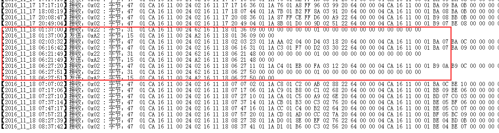
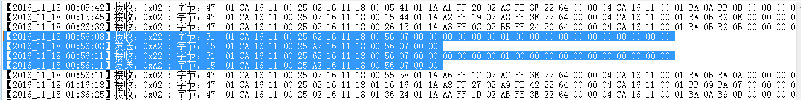

# VD background log alert

The AP continuously generates 0x22 battery failure alarms, and all four VDs generate 0x22 rtC alarms:

After DC_01CA16110024 and DC_01CA16110025 generate alarms, it takes a long time to recover (>60 minutes);

After DC_01CA16110021 and DC_01CA16110028 generate alarms, they need to be restored in a short time (<20 minutes).

DC_01CA16110021 had 3 alarms on November 17th, and no alarms before 8:30 on the 18th;

DC_01CA16110024 had 6 alarms on November 17th and 3 alarms before 8:30 on the 18th;

DC_01CA16110025 had 7 alarms on November 17th and 2 alarms before 8:30 on the 18th;

DC_01CA16110028 had 2 alarms on November 17th, and 2 alarms before 8:30 on the 18th.

**VD 0x22 alarm log**

****

**AP 0x22 alarm log**

## Parking space detector heartbeat--0x02

### Workflow

The VD node actively sends heartbeat data to the FES at regular intervals, including parking space status, temperature, magnetic signal value, battery voltage, remaining battery power, etc. The recommended heartbeat sending cycle is 30 minutes, which can be changed by the FES during operation.
The AP needs to send a response message upon receiving the heartbeat data, and the VD node waits for this response to confirm that it is in a normal communication state in the network. The FES may not send a response corresponding to this message.

### VD instruction--0x02

| **Field**   | **Size** | **Type** | **Cnt** | **Contend**                             | **Description**                                              |
| ----------- | -------- | -------- | ------- | --------------------------------------- | ------------------------------------------------------------ |
| op          | 1        | uint8    | 1       | 0x02                                    | Command word                                                 |
| tstamp      | 6        | BCD      | 6       | 0x16 0x01 0x02 0x03 0x04 0x05           | Timestamp (the local time when VD generates data). For example, 16 01 02 03 04 05 represents 3:04:05 on January 2, 2016. |
| status      | 1        | uint8    | 1       | {0,1,2,3}                               | Current status of the parking space. 0: No car, 1: Car present, 2: Waiting for activation, 3: Initializing. |
| temperature | 1        | int8     | 1       | -10                                     | The temperature value at that time, in units of 1℃. For example, -10 represents -10℃. |
| seqno       | 1        | uint8    | 1       | 1                                       | Message sequence number                                      |
| magnetic    | 6        | int16    | 3       |                                         | The 3-axis magnetic field X/Y/Z sampling data at that time.  |
| batVoltage  | 1        | uint8    | 1       | 33                                      | Battery voltage, in units of 0.1V. For example, 33 represents a voltage of 3.3V. |
| batQuantity | 1        | uint8    | 1       | 56                                      | The remaining battery power, expressed as a percentage. For example, 56 indicates that 56% of the power remains. |
| parent      | 8        | BCD      | 8       | 0x00 0x00 0x02 0xCA 0x16 0x04 0x00 0x03 | The MAC address of the currently selected parent node (RP or AP) is used by FES analysis to form the current network topology and data transmission path. When VD is a one-hop neighbor node of the AP, it is the MAC address of the AP; otherwise, it is the MAC address of the RP. |
| recvRSSI    | 1        | int8     | 1       |                                         | VD receives the average signal strength of messages sent to it by the parent node, measured in dbm. |
| recvLQI     | 1        | int8     | 1       |                                         | VD receives the average channel quality indicator LQI of the messages sent to it by the parent node. The interface displays the original value. |
| sendRSSI    | 1        | int8     | 1       |                                         | The signal strength of this heartbeat message received by the parent node, which is filled in by the parent node before forwarding this message. The unit is dbm. |
| sendLQI     | 1        | int8     | 1       |                                         | The channel quality indicator of this heartbeat message received by the parent node is filled in by the parent node before forwarding this message. The interface displays the original value. |

## Alarm data--0x22

## Workflow

When the VD/RP/AP node detects faults, such as sensor faults, memory faults, etc., during periodic peripheral self-tests, it actively sends this data packet to the FES to report the fault status.This communication data definition includes all sub-hardware modules. If a module does not exist, its value is always 0, and the FES should ignore this field according to the node type when processing. For example, if the VD does not have memory 2, then flash2 is always 0.
 After receiving the alarm data packet, FES must send a response data packet to the source node. If VD/RP/AP nodes do not receive the response data packet within the timeout period, they should retransmit until they receive the response or reach the maximum number of retransmissions.

### VD/RP/AP instruction--0x22

| **Field** | **Size** | **Type** | **Cnt** | **Contend** | **Description** |
| --- | --- | --- | --- | --- | --- |
| op        | 1        | uint8    | 1       | 0x22                                    | Command word                                                 |
| tstamp    | 6        | BCD      | 6       | 0x16 0x01 0x02 0x03 0x04 0x05           | Timestamp (local time) . |
| seqno     | 1        | uint8    | 1       | 0x01                                    | Message sequence number                                      |
| radio     | 1        | uint8    | 1       | {0,1}                                   | RF fault code. 0: normal, 1: weak signal                     |
| sensor1   | 1        | uint8    | 1       | {0-2}                                   | Magnetic sensor 1 fault code. 0: normal, 1: sampling failure, 2: saturation |
| sensor2   | 1        | uint8    | 1       | {0-2}                                   | Magnetic sensor 2 fault code. 0: normal, 1: sampling failure, 2: saturation |
| flash1    | 1        | uint8    | 1       | {0-2}                                   | Flash memory 1 fault code. 0: normal, 1: R/W failure, 2: full |
| flash2    | 1        | uint8    | 1       | {0-2}                                   | Flash memory 2 fault code. 0: normal, 1: R/W failure, 2: full |
| rtc       | 1        | uint8    | 1       | {0-2}                                   | RTC fault code. 0: normal, 1: malfunction, 2: severe drift   |
| battery   | 1        | uint8    | 1       | {0,1}                                   | Battery fault code. 0: normal, 1: low voltage                |
| solarBat  | 1        | uint8    | 1       | {0,1}                                   | Solar battery fault code. 0: normal, 1: low voltage          |
| parent    | 8        | BCD      | 8       | 0x00 0x00 0x02 0xCA 0x16 0x04 0x00 0x03 | MAC address of parent node (RP or AP). Used for network topology analysis. |

### FES response--0xA2

| Field | **Size** | **Type** | **Cnt** | **Contend** | **Description** |
| --- | --- | --- | --- | --- | --- |
| op | 1 | unit8 | 1 | oxA2                          | Command word |
| tstamp | 6 | BCD | 6 | 0x16 0x01 0x02 0x03 0x04 0x05 | Timestamp,  should be the same as the field with the same name in the command/request |

